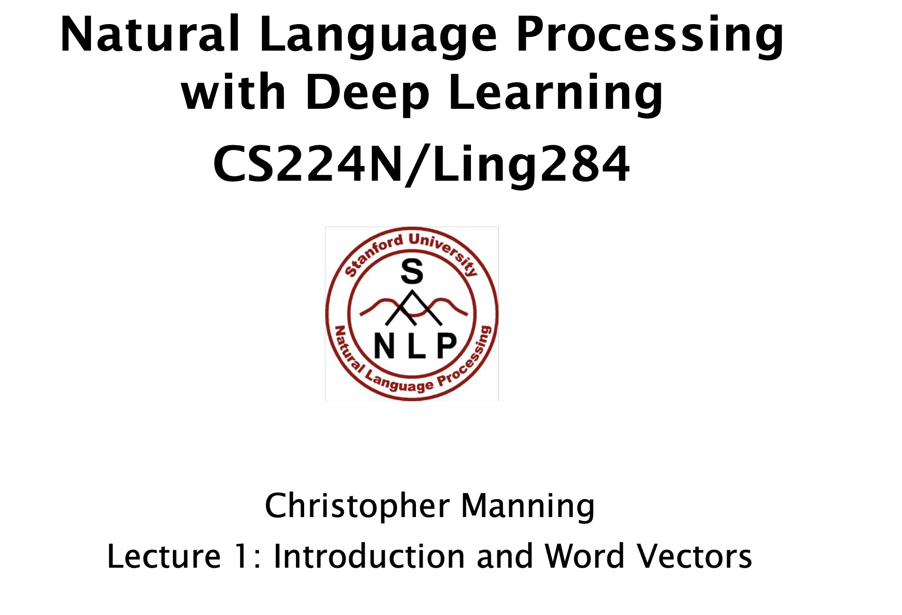
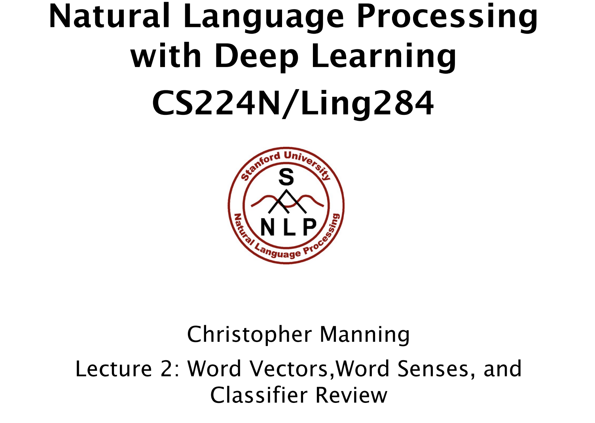

============
自然语言理解
============
.. note:: 

    更新日期：2020年04月01日
    

书籍推荐
==========

1. `《Speech and Language Processing, 2nd Edition》 <https://book.douban.com/subject/2403834/>`_
    - 内容全面，覆盖面广
2. 《统计自然语言处理》 宗成庆
3. 《信息检索导论》
4. 《语言本能-人类语言进化的奥秘》

什么是 自然语言 理解？
======================
自然语言？
----------
1. 和编程语言相对的语言称为自然语言。

自然语言理解？
----------------

1. 目的：使计算机理解人类的自然语言。
2. 本质：结构预测的过程。如输出一句话的句法结构或者语义结构。
3. 从无结构化序列预测有结构的语义。
    - 词性标注、命名实体识别、依存分析、句法分析、指代消解等任务。
4. 数据驱动的自然语言理解
    - 深度学习技术的突破
5. 语义表示（核心）
    - one-hot （0/1）也称独热编码
        + 表示简单，但局限性很大，如相似度计算。
    - 分布式语义表示 （空间表示）
        + 目前最主要的表示形式。
        + 1986年提出的方法。

自然语言的特点
--------------

1. 歧义性多。
    ```
    南京市/长江大桥。南京市长/江大桥。
    ```
    - 关键目标：消除歧义性。
2. 递归性
    ```
    你好/不好意思。 你/好不好意思。
    ```
3. 主观性
    ```
    仔细体会这两句：别回了。 我没事，你忙你的。
    ```
4. 社会性
    - 敬语、语言协调等

难点
---------

1. 语言的语义表示
    - 世界（社会/客观）、心智（人/主观）、语言三者相互影响。
2. 将人类的知识融入到语义表示的过程中。
    - 人类知识相当于给足了上下文信息
3. 多模态复杂语境的理解 (说话的表情、手势动作、场景等)
    - 欢迎/新老/师生/前来/参观！
    - 欢迎/新老师/生前/来参观！

未来
-----------

1. 句子消歧。
2. 引入知识。如知识图谱。
3. 多级的跨句子建模。
4. 生成句子更符合当下对话场景。
5. 理解并创作。

自然语言理解交叉科学
----------------------

1. 计算机科学
2. 脑科学
3. 语言学
4. 语言哲学
5. 心理学、社会学、认知学
6. 神经语言学、汉语言学

自然语言技术方向
====================

- 基于规则驱动
- 基于数据驱动
    - 统计学语言模型
    - 深度语言模型

NLP国内外优秀学者及实验室
==============================
- `Christopher Manning <https://nlp.stanford.edu/~manning/>`_

========================================
CS224n-2019-课程笔记 by Chris Manning
========================================

.. tip::

    - `CS224n-2019 <https://web.stanford.edu/class/archive/cs/cs224n/cs224n.1194/>`_.课程源自斯坦福CS course，2019年发布的自然语言处理，算是NLP的经典吧，老爷子讲的也很风趣幽默。Ok, Hello, everyone!一起来追剧吧。
    - 题外话：课时并不多，所以暗示自己要尽量耐心地把每一节的知识搞懂（慢工出细活，理论知识很重要），自己思考的同时也要动手推导公式甚至编写代码（我就是这么弄得）来刺激大脑理解，难受一阵会发现知识理解很深刻，再回顾此前的知识，豁然开朗！

一些说明和资源
==============
- `课程主页 <http://web.stanford.edu/class/cs224n/index.html>`_
- 本笔记涉及代码部分将使用pipenv构建虚拟环境。（推荐）
- 课后作业使用PyTocrh框架使用。
    + HW1-HW5.
    + FP,which is QA .
- `B站资源 <https://www.bilibili.com/video/BV1Eb411H7Pq/?spm_id_from=333.788.videocard.0)>`_
- `笔记参考1 <https://looperxx.github.io/CS224n-2019-01-Introduction%20and%20Word%20Vectors/>`_
- `笔记参考2 <https://www.cnblogs.com/marsggbo/p/10205943.html>`_

词向量（Word Vectors)
=========================


自然语言和词义
---------------
1. 自然语言
    - 你永远无法确定任何单词对他人意味着什么。（中文这个情况就更普遍啦）
    - 写作是另一件让人类变得强大的事情，这实现了知识的传播和共享。
2. 语言的意义
    - 通过一个词或句子等来表达概念
    - 人们通过文字或声音信号等来表达思想、想法
    - 在写作、艺术中表达含义

::

    一般通过下面这种语言方式进行有意义的思考:
        signifier(symbol)⇔signified(idea or thing) =denotational semantics 

3. 语义计算
    - 常见方案的不足
        + 类似 `WordNet <https://wordnet.princeton.edu/)>`_ 一个面向语义的英语词典，包含上义词（hypernyms）、同义词（synonym sets）。
            - 没有考虑上下文，忽略一个词的细微差别
            - 不能及时更新。
            - Can’t compute accurate word similarity
        + 传统NLP的做法。离散符号表示。one-hot，0-1进行编码：Means one 1, the rest 0s
            - 向量大小就是词汇表的大小（很多无用的信息）
            - 无法计算相似度。如下例两个词向量是正交的，点积为0.
            
            ::

                motel = [0 0 0 0 0 0 0 0 0 0 1 0 0 0 0]
                hotel = [0 0 0 0 0 0 0 1 0 0 0 0 0 0 0]

    - 提取新方案
        + Could try to rely on WordNet’s list of synonyms to get similarity?
        + learn to encode similarity in the vectors themselves（学习词自身的编码信息）
4. 通过上下文表示词
    - 分布式语义：一个词的含义往往是由附近高频出现的词决定的。
    - word出现在文本中，这个Word周围会有由词的集合组成的Context出现。这个上下文是固定一个窗口size的。
    - 我们可以使用存在Word的大量 `语料 <http://ling.cuc.edu.cn/RawPub/)>`_ 来学习其向量表示。比如学习“中国科学院”词（实际中会学习每个词），在下列的语料中。
            1. 先向获得2009年度国家最高科学技术奖的 **中国科学院** 院士、复旦大学数学研究所名誉所长谷超豪和
            2. 院士、复旦大学数学研究所名誉所长谷超豪和 **中国科学院** 院士、中国航天科技集团公司高级技术顾
            3. 大国”向“造船强国”迈进。 由 **中国科学院** 和上海市政府共同建设的上海同步辐射光源工
            4. 丽；河南卓越工程管理有限公司董事长邬敏 **中国科学院** 研究生院教授杨佳十人“全国三八红旗手

Word Vectors(词向量)
-------------------------
- 根据一个的词的上下文，来为词构建密集的向量，以使得该向量与出现在类似上下文中的词相似
- 引出词向量，也称词嵌入或词表示。
    + word vectors are sometimes called **word embeddings** or word representations. 
    + They are a **distributed representation**.
    + 例如“中国”这个词经过训练后的词向量为：

.. math::
    中国 = \begin{pmatrix} 0.286\\
                0.792\\
                −0.177\\
                −0.107\\
                0.109\\
                −0.542\\
                0.349\\
                0.271 \end{pmatrix}

Word2Vector介绍
-------------------------
.. note::
    Word2vec (Mikolov et al. 2013) 是一种学习词向量的 *框架*。

主要思想
^^^^^^^^^
1. 我们有个比较大的文本数据集。
2. 文本中的每个词通过一个固定长度的词向量表示。
3. 扫描文本中每一个位置 **t** 所表示的词,其中有一个中心词 **c** 和上下文词 **o** 。
4. 通过c和o的词向量的相似性，计算在给定c,即中心词来计算o,即上下文的概率。反之亦然。
5. 不断调整词向量来最大化上面提到的概率。

- 举例如下

    .. image:: ./images/nlp/w2v_ex-1.png

    .. image:: ./images/nlp/w2v_ex-2.png

Word2Vector目标函数
-----------------------------
1. 思路(后面要说的Skip-grams模型）

    在每个位置 :math:`t` （t = 1，……，T)，给定一个中心词 :math:`w_j` 和一段固定长度的窗口 :math:`m`，预测上下文中每个单词的概率。

.. math::
    Likelihood = L(\theta) = \prod_{t=1}^{T}\prod _{\substack{-m\leq j \leq m \\ j\neq 0}}P(w_{t+j}|w_t;\theta)
    
    其中 \theta 是一个需要全局优化的变量

- 目标函数 :math:`J(\theta)` （也称为 **代价或损失函数**）,是一个负对数似然：

    .. math::
        J(\theta) = -\frac{1}{T}logL(\theta) = -\frac{1}{T}\sum_{t=1}^{T}\sum _{\substack{-m\leq j \leq m \\ j\neq 0}}P(w_{t+j}|w_t;\theta)


Q1： 如何计算 :math:`P(w_{t+j}|w_t;\theta)`?

A1： 每个词w用两个向量表示

    - 当w是中心词时用向量 :math:`v_w` 表示 
    - 当w是上下文词时用向量 :math:`u_w` 表示 

那么对于一个中心词c和上下文词o可用如下形式表示

    .. math::
        P(o|c) = \frac{exp(u_o^T v_c)}{\sum_{w\in V} exp(u_w^Tv_c)}

    其中，:math:`u_o^T v_c`点积表示o和c的相似度，点积越大则表示概率越大；:math:`{\sum exp(u_w^Tv_c)}`
    目的是为了对整个词汇表进行标准化。

- softmax function
    softmax函数作用是将任意标量 :math:`x_i`映射为概率分布 :math:`p_i` 。

    .. math::

        softmax(x_i) = \frac{exp(x_i)}{\sum_{j=1}^{n} exp(u_w^Tv_c)} = p_i

    - “max"对比较大的 :math:`x_i` 映射比较大的概率
    - ”soft" 对那些小的 :math:`x_i` 也会给予一定概率
    - 这是一种常见的操作，如深度学习

.. tip::
    - 利用对数的特性将目标函数转换为对数求和，减少计算的复杂度。
    - 最小化目标函数 ⟺最大化预测的准确率

- 通过不断的优化参数最小化误差来训练模型。
- 为了训练模型，需要计算所有向量的梯度
    + :math:`\theta` 用一个很长的向量表示所有模型的参数。
    + 每个单词有个两个向量。
        - Why two vectors? àEasier optimization. Average both at the end.
    + 利用不断移动的梯度来优化这些模型的参数。

梯度计算推导
-------------------------
下面开始推导 :math:`P(w_{t+j}|w_t;\theta)`:
对 :math:`v_c` 求偏微分

.. math::
    \frac{\partial}{\partial v_c }logP(o|c) 
    &= \frac{\partial}{\partial v_c }log\frac{exp(u_o^T v_c)}{\sum_{w\in V} exp(u_w^Tv_c)}\\
    &=\frac{\partial}{\partial v_c}\left(\log \exp(u_o^Tv_c)-\log{\sum_{w\in V}\exp(u_w^Tv_c)}\right)\\
    &=\frac{\partial}{\partial v_c}\left(u_o^Tv_c-\log{\sum_{w\in V}\exp(u_w^Tv_c)}\right)\\
    &=u_o-\frac{\sum_{w\in V}\exp(u_w^Tv_c)u_w}{\sum_{w\in V}\exp(u_w^Tv_c)}\\
    &=u_o-\sum_{w\in V}\frac{\exp(u_w^Tv_c)}{\sum_{w\in V}\exp(u_w^Tv_c)}u_w\\
    &=u_o-\sum_{w\in V}P(w|c)u_w\\


    其中，u_o是我们观测到每个词的值，\sum_{w\in V}P(w|c)u_w是模型的预测值，\\
    利用梯度下降不断使两者更为接近，使偏微为0.


还有对 :math:`u_o` 的偏微过程，大家动手推导下，比较简单的。

.. tip::

    补充一点边角知识，在上面的推导过程中用的到：

    - 向量函数与其导数 :math:`\frac{\partial Ax}{\partial x} = A^T, \frac{\partial x^T A}{\partial x} = A`
    - 链式法则：:math:`log'f[g(x)] = \frac{1}{f[g(x)]}g'(x)`


word2vector的概览
--------------------
前面提到的Word2Vector是一种学习词向量的框架（模型），它包含两个实现算法：

1. Skip-grams (SG) （课上讲的就类似这种）

    + 根据中心词周围的上下文单词来预测该词的词向量

2. Continuous Bag of Words (CBOW)

    + 根据中心词预测周围上下文的词的概率分布。

另外提到两个训练的方式：

1. negative sampling (比较简单的方式)

    + 通过抽取负样本来定义目标

2. hierarchical softmax

    + 通过使用一个树来计算所有词的概率来定义目标。

优化：梯度下降与随机梯度下降算法的要点
--------------------------------------
- 梯度下降（Gradient Descent，GD）
    1. 最小化的目标（代价）函数 :math:`J(\theta）`
    2. 使用梯度下降算法去优化 :math:`J(\theta）`
    3. 对于当前 :math:`\theta` 采用一个合适的步长（学习率）不断重复计算 :math:`J(\theta）` 的梯度，朝着负向梯度方向。

    .. image:: ./images/nlp/SG.jpg

    4. 更新等式（矩阵）

        .. math::

            \theta^{new} = \theta^{old} - \alpha\nabla_\theta J(\theta)

            其中，\theta = 步长（学习率）

    5. 更新等式（单个参数）
        .. math::

            \theta_j^{new} = \theta_j^{old} - \alpha\frac{\partial}{\partial \theta_j^{old}}J(\theta)

- 随机梯度下降（Stochastic Gradient Descen, SGD）
    + 目的
        进一步解决 :math:`J(\theta）` 的训练效率（因为目标函数包含所有的参数，而且数据集一般都是很大的）问题：太慢了。
    + Repeatedly sample windows, and update after each one


小结
-------------------------
- 本节首先从语言的语义问题开始讲起，然后为了表示语义，引出了词向量概念，接着着重讲了Word2Vector框架、原理、算法推导等，最后简单提了下目标函数的优化的方式。
- 看完并梳理完本节知识，我产生了几个问题：
    + 词向量提了好多次，那么每个词的词向量究竟是如何产生（计算）的呢？存在哪些方法？
    + 有几个点的原理还需进一步深入理解：
        - 负采样、层次采样；区别和前后的优势在哪里？
        - SG、CBOW算法的细节；本质区别和各自优势是什么？


词向量和语义
======================
.. note::
    本节课后，我们就能够开始读一些关于词嵌入方面的论文了。




Review：word2vec
-----------------------------
主要思想
^^^^^^^^^
- 这里以skip-gram）模型为例
    1. 遍历整个语料库的每个词，通过中心词向量预测周围的词向量
    2. 算法学到的词向量能用来计算词的相似度或语义等相关需求。

关于梯度计算
^^^^^^^^^^^^^
- GD。计算效率低，每次对所有样本进行梯度计算
- SGD。每次只对一个固定大小的样本窗口进行更新，效率较高。
- 梯度计算存在稀疏性（0比较多）
    + But in each window, we only have at most 2m + 1 words, so it is very sparse!
    + 解决方案： 
        - only update certain rows of full embedding matrices U and V. (使用稀疏矩阵仅更新稀疏性低的词向量矩阵U和V)
        - you need to keep around a hash for word vectors （使用hash来更新，即k-v，k表示word,v表示其词向量）

基于负采样(negative sample)方法计算
^^^^^^^^^^^^^^^^^^^^^^^^^^^^^^^^^^^^^^
1. 计算下列式子：
    .. math::

        P(o|c) = \frac{exp(u_o^T v_c)}{\sum_{w\in V} exp(u_w^Tv_c)}
    
    其中 :math:` {\sum_{w\in V} exp(u_w^Tv_c)}` 计算代价非常大（整个语料库计算），如何降低这一块的计算复杂度就是需要考虑的问题。

2. 负采样方法介绍
    + 主要思想：train binary logistic regressions。除了对中心词窗口大小附近的上下文词取样以外(即true pairs)，还会随机抽取一些噪声和中心词配对（即noise pairs）进行计算，而不是遍历整个词库。
    + 这个 **负** 指的是噪声数据（无关的语料词 noise pairs）

3. 负采样计算细节

.. tip::

    可参考论文 `Distributed Representations of Words and Phrases and their Compositionality” (Mikolov et al. 2013) <https://github.com/lihanghang/NLP-Knowledge-Graph/raw/master/%E8%87%AA%E7%84%B6%E8%AF%AD%E8%A8%80%E5%A4%84%E7%90%86/%E8%AF%AD%E8%A8%80%E8%A1%A8%E7%A4%BA%E6%A8%A1%E5%9E%8B/Tomas%20Mikolov%20papers/Distributed%20representations%20of%20words%20and%20phrases%20and%20their%20compositionality.pdf>`_ 第3页。


+ 最大化下面的目标函数

    .. math::

        J(\theta) = \frac{1}{T}\sum_{t=1}^{T}J_{t}(\theta)

    
    .. math::

        J_{t}(\theta)=\log \sigma(u_{o}^{T} v_{c})+\sum_{i=1}^{k} \mathbb{E}_{j \sim P(w)}[\log \sigma(-u_{j}^{T} v_{c})]
        
        其中，\sigma(x)=\frac{1}{1+e^{-x}}
        
    - 公式第一项表示最大化真实的中心词和其上下文词的概率；第二项是最小化负采样的噪声值（中心词及其上下文）的概率，j表示负采样的样本，并以P(w)大小进行随机采样。
        
    .. note:: 

        + P(w)，这里使用了N元统计模型且N取1，即一元统计模型（unigram），表示每个词都和其它词独立，和它的上下文无关。每个位置上的词都是从多项分布独立生成的。
        + 补充N元统计模型，N=2时就为二元统计模型，即每个词和其前1个词有关。一般的，假设每个词 :math:`x_t` 只依赖于其前面的n−1个词（n 阶马尔可夫性质）。
        + 通过N元统计模型，我们可以计算一个序列的概率，从而判断该序列是否符合自然语言的语法和语义规则。
        + 这个方法在构建词向量时最大的问题就是 **数据稀疏性**，大家可以思考下为什么？还能想到改进或其他更好的方法？


基于共现矩阵生成词向量
--------------------------
But why not capture co-occurrence counts directly?
1. 主要思想

    - 有一个共现矩阵x，其可选的粒度有两种：固定窗口大小的window、文档级的document
        + window级别的共现矩阵： 类似有word2vector，利用每个词使用固定的窗口大小来获取其语法或语义信息。
            - 例如，window_len = 1的单词与单词同时出现的次数来产生基于窗口的co-occurrence matrix。
                - 语料： I like deep learning. I like NLP. I enjoy flying. c
                
                .. image:: images/nlp/co_matrix.png

            - 解释下上述矩阵的含义：按窗口为1，同时出现的原则，I I语料没有这样的表达即同时出现的次数为0，I like 前两条都出现了，即为2。
            - 简单观察矩阵，就会发现很稀疏，存在大量的0，而且随着语料库的增大，维数也会增大，这显然不是最佳方法，得想办法增加空间的利用率，目标就是稀疏变稠密，以免因稀疏性对下游任务造成影响。
        
        + document级别的共现矩阵：基本假设是文档若存在相关联，则其会出现同样的单词。一般使用“Latent Semantic Analysis”（LSA)潜在语义分析方法进行矩阵的生成

2. 问题：怎么对共现矩阵进行降维呢？

    - Singular Value Decomposition（SVD)奇异值分解

        + 将矩阵X分解为 :math:`U \Sigma V^{\top} \Sigma` 是对角阵，其主对角线的每个值都是奇异值；U和 :math:`V^{\top}` 两个正交矩阵
        
        .. image:: images/nlp/SVD.png

        .. note::
        
            1. SVD就是将一个线性变换分解为两个线性变换，一个线性变换代表旋转，一个线性变换代表拉伸。
            2. 正交矩阵对应的变换是旋转变换，对角矩阵对应的变换是伸缩变换。
            3. 这里我们可以再联想对比另外一个经典的降维算法PCA。
3. Hacks to X

    - 按比例缩放计数会有很大帮助。（怎么讲？）哦，就是对一些高频的功能性（has、the等）词进行缩放，缩放后不会影响句法结构或者语义等
        + min(X,t), with t ≈ 100
        + 忽略这些词
    - 定义一个Ramped windows，统计距离很小（关联度高）的的词。（距离越小，代表关联度越高）
    - 使用皮尔逊相关系数来替换直接计数方式，并设无关联值为0。

    .. note::
        Pearson相关系数是衡量向量相似度的一种方法。输出范围为-1到+1, 0代表无相关性，负值为负相关，正值为正相关。

Glove词向量模型
-----------------
.. tip::

    可参考阅读 `Glove <https://nlp.stanford.edu/projects/glove/>`_ 主页

1. 基于计数和直接预测的比较

    .. image:: images/nlp/count_predict.png

    - 基于计数（统计理论）
    - 直接预测（概率模型或神经网络）

    **到底哪一个方法是正法呢，还是说走向合作呢？答案是合作，相互借鉴才能发挥更大价值（1+1>2)**

2. 探索在向量间的差异中挖掘语义
    - 方向：能在共现矩阵的概率的比值中看出语义相关

    .. image:: images/nlp/co_matrix_ratio.png

    - 解释下表所传递的信息：当需知道ice冰和steam气的关系时，可借助词k：
        + 当k=solid，k和ice近似，这时ratio>>1；==> solid与ice有关
        + 当k=gas，k和steam接近时，ratio<<1；==> gas与steam有关
        + 当k=water/fashion等与2个词都不相关时，ratio≈1。==> 之间无关

**通俗的讲下这个比值：1为阈值，当远大于1或远小于1就说明词之间有相关度的；当接近于1时证明无关**

3. 如何表示共现矩阵的概率的比值呢？

    - Log-bilinear model：:math:`w_i \cdot w_j = log P(i|j)`
    - 使用向量差值表示：:math:`w_x \cdot(w_a - w_b) = log \frac{P(x|a)}{P(x|b)}`

4. Glove目标函数为：
    .. math::

        J=\sum_{i, j=1}^{V} f\left(X_{i j}\right)\left(w_{i}^{T} \tilde{w}_{j}+b_{i}+\tilde{b}_{j}-\log X_{i j}\right)^{2}

    - 其中f(x)如下图所示：

        .. image:: images/nlp/glove_fun.png

    - :math:`X_{i j}` 表示词j在词i的上下文中出现的次数。

5. Glove的优势
    + 训练速度快
    + 可扩展到大语料库
    + 即时小预料库，其效果也不错

怎样评估词向量？
------------------
1. 问题：如何评估NLP的模型。
2. 主要从两个方面：内部和外部
    - 内部（自身评估）
        + 评估特定或中间子过程：速度快、有利于理解整个模型
    - 外部（将词向量应用到下游任务，如推荐、搜索、对话等系统中）
        + 在真实场景下进行评估：消耗时间可能过长、不明确子系统是否有交互问题。
        + 如果用一个子系统替换另外一个子系统后能提高准确率，那这个模型就很棒了
        + 词向量应用到搜索、问答等领域来进行效果评估

3. 评估：词向量
    + 通过计算余弦距离后并求和来获取语义和相似的句法。
    + 技巧：丢弃输入的几个关键词，以此来验证词向量的相似度计算性能
    + 例：a:b :: c:?  man:woman :: king:? man-->king那么woman-->?
        - 在语料中找到一点 :math:`x_i`，即为和woman最为相近的词

    .. math::

        d=\arg \max _{i} \frac{\left(x_{b}-x_{a}+x_{c}\right)^{T} x_{i}}{\left\|x_{b}-x_{a}+x_{c}\right\|}

    .. image:: images/nlp/w2v_eva.png

    + 下面是glove的某些词向量相似度可视化的结果
        
        .. image:: images/nlp/glove_vi.png

4. 评估：相似性和参数
    + Glove的语义或句法相似度表现的更好，如下表：

        .. image:: images/nlp/glove_w2v.png

    + 特点：语料的规模要大、词向量维数为300更合适

        .. image:: images/nlp/glove_dim.png

5. 相关性评估（距离）

    .. image:: images/nlp/glove_corr_eva.png

6. 外部评估
    + 词向量好不好最直接的方法就是应用到实际场景，比如最常用的NER（命名实体识别）任务中

        .. image:: images/nlp/glove_ner.png

    + glove对于NER任务表现理论上还说的过去，但凭上表中的准确率在工业领域中还是很难拿来用的。那么还有什么好的模型或者思路呢？
    + 从下一小节就开始尝试将词向量输入到神经网络中，来进一步提升下游任务的性能。

语义及其歧义性
------------------
.. note::

    实际上，许多词都是一词多义的，特别是咱们的汉语，更甚有如今曾层出不穷的网络流行语，有时你不懂点八卦还真的猜不来词要表达的真实含义！这就是NLP绕不开的一个问题：歧义性，对应的任务就是：消歧。

- 看下单词 **pike** 的含义

    .. image:: images/nlp/w2v_ambiguity.png

    + 看上图易知词的含义还是相当丰富的，如何相对准确的捕捉到当前场景下（上下文）的真实含义就是值得思考和研究的一个问题。

1. 论文1：Improving Word Representations Via Global Context And Multiple Word Prototypes (Huang et al. 2012)
    
    .. image:: images/nlp/cluster_word.png

    + 使用了聚类的思路：通过一些关键词来聚类，但常常出现重叠（误分）的现象

2. 论文2：Linear Algebraic Structure of Word Senses, with Applications to Polysemy
将同一词的不同语义进行线性叠加
    
    .. math::

        v_{\text { pike }}=\alpha_{1} v_{\text { pike }_{1}}+\alpha_{2} v_{\text { pike }_{2}}+\alpha_{3} v_{\text { pike }_{3}} \\ \alpha_{1}=\frac{f_{1}}{f_{1}+f_{2}+f_{3}}
    
        f为词出现的频率
    
    + 论文的思路来自词向量的稀疏编码，


分类（Classification）模型知识点回顾
----------------------------------------
1. 样本（数据集）：:math:`\{x^{(i)},y^{(i)}\}_{1}^{N}`，其中x_i为输入（词、句、文档等）y_i就是标签，
预测的分类目标（正负向、文档主题等）`

2. 例如简单的二分类
    
    + 可视化 `地址 <https://cs.stanford.edu/people/karpathy/convnetjs/demo/classify2d.html>`_

    .. image:: images/nlp/cls_ex.png

3. 一般的机器学习方法或统计方法：假定 :math:`{x_i}` 为固定大小，我们使用sofmax或逻辑回归算法训练权重参数W，以此来寻找一个决策边界。
   + 例如softmax算法，对于固定的 :math:`{x}` 预测y：

    .. math::

        p(y\mid x)=\frac{exp(W_{j.}x)}{\sum_{c=1}^{C}exp(W_{c.}x)}


    .. image:: images/nlp/softmax_detail.png

    + 我们的目标就是最大化正确类别y的概率，不过我们一般为了降低运算的复杂度，会转为下式进行计算：

    .. math::

        -log P(y|x) = -log(\frac{exp(f_y)}{\sum_{c=1}^{C}exp(f_c)})


4. 交叉熵损失
    1. 交叉熵的概念源自信息论中的知识，对于样本实际的概率分布P与模型产生的结果概率分布q，其交叉熵可表示为下式：
        
        .. math::

            H(p,q) = -\sum_{c=1}^{C}p(c)logq(c)

    2. 整个数据集 :math:`\{x^{(i)},y^{(i)}\}_{1}^{N}` 的交叉熵可表示为：
        .. math::

            J(\theta) = \frac{1}{N}\sum_{i=1}^{N} - log\bigg(\frac{e^{f_{y_i}}}{\sum_{c=1}^{C}e^{f_c}}\bigg)

        :math:`f_y = f_y(x)=W_y·x=\sum_{j=1}{d}W_{y_j}·x_j`
5. 优化

- 传统机器学习方法优化

对于 :math:`\theta` 的数量一般和权重W的维数一致，线性决策模型至少需要一个d维的词向量输入和生成一个 
C个类别的分布。因此更新模型的权值，我们需要 C⋅d个参数

.. math::

   \theta =  \begin{bmatrix}{W_{.1}} \\ \vdots \\ {W_{.d}}  \end{bmatrix} = W(::)\in\mathbb{R}^{Cd}

梯度优化：更新决策边界的参数
    .. math::
        \nabla_{\theta}J(\theta) = {\begin{bmatrix} \nabla_{W_{.1}} \\ \vdots \\ \nabla_{W_{.d}}  \end{bmatrix}}\in\mathbb{R}^{Cd}

6. 使用神经网络+词向量分类
一般的分类算法其通常解决的是一些线性问题，表达能力有限，对一些非线性的决策边界无法更好的建模，借用神经网络模型可进一步提升模型的能力。
 
    - 基于神经网络分类(模型的预测能力更强)
        .. image:: images/nlp/neural_cls.jpg

    - 词向量与神经网络模型结合
        +   同时学习权重W和词向量x，参数量为：cd+vd，非常大的参数量，C表示分类大数量，d表示每个词向量维数，V表示词汇表的大小。
        
        .. math::
        
            \begin{eqnarray} \nabla_{\theta}J(\theta) = \begin{bmatrix}\nabla_{W_{.1}} \\ \vdots \\ \nabla_{W_{.d}} \\ \nabla_{aardvark} \\ \vdots \\ \nabla_{zebra} \end{bmatrix} \nonumber \end{eqnarray}\\
        
        + 参数量大意味着表达（拟合数据）能力很强（这里可以联系数学中的多项式，参数多了意味着多项式越长，图像也就越复杂），但过犹不及，容易造成过拟合，模型泛化能力不足，怎么办呢？常见做法就是加入 **正则项**

小结   
------
本节首先讲了词向量的训练基本过程和常用方法：解决维数高、复杂度高的问题；其次，讲了Golve的主要思想；最后通过分类引出神经网络的优势：非线性能力，能够更好地获取语义信息。后续小节将开始神经网络的篇章。


神经网络
===========


