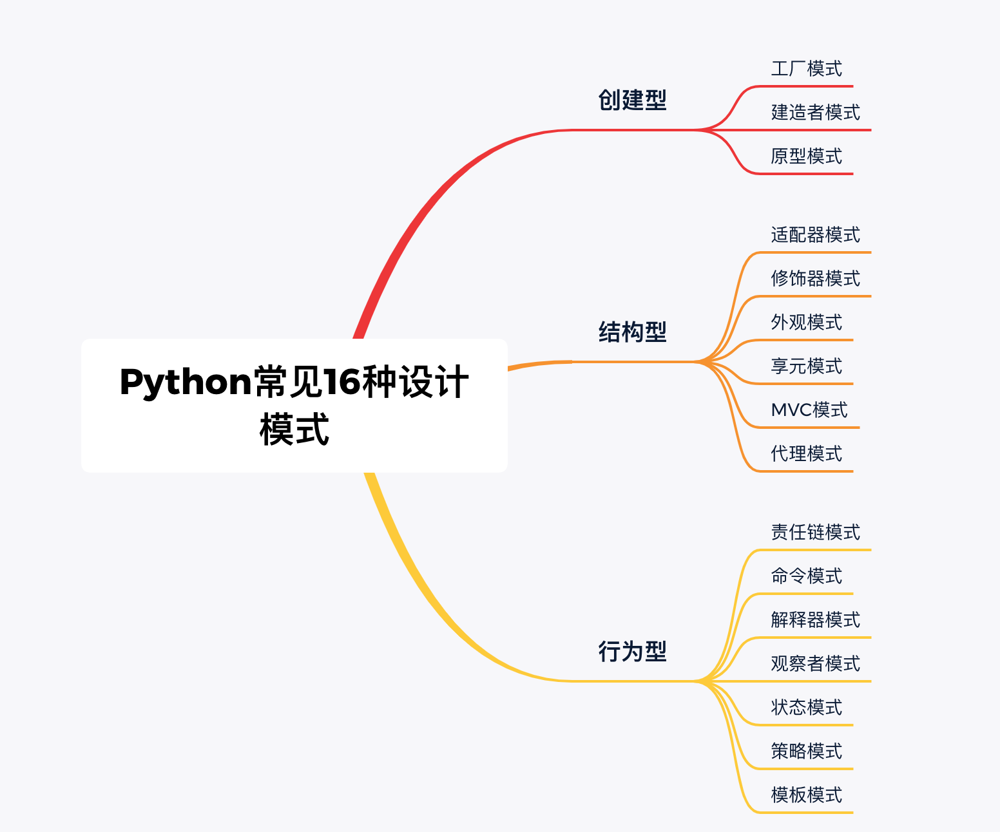

===============
设计模式
===============

update: 2020-05-11

.. note::
    设计模式比较抽象，都是思想层面的，仅仅是归纳总结的软件设计思路，不是万灵药，切不可生搬硬套。设计模式的目的就是为了是软件系统各功能更灵活、架构清晰、协同性好、可维护性、可扩展性等只要能达到这些目的你的设计模式（抽象类）就是值得点赞的！

书籍推荐
============
1. 《大话设计模式》
2. 《设计模式-可复用面向对象软件的基础》（经典）
3. 《精通Python设计模式》 

.. note::
    推荐两本书，可以看看。第二本书比较全面讲了23种模式，可作为日常完善所需，我重点看了第三本书讲的基于Python常见设计模式，总体划分了三种类型：创建型、结构型、行为型。

知识框架图
==============

初识设计模式
====================
什么是设计模式？
-------------------
1. 定义
    + 对用来在特定场景下解决一般设计的问题的类和相互通信的对象的描述。
2. 模式四要素
    1. 模式名称(P)。
    2. 问题(I)。
    3. 解决方案（S)。
    4. 效果（C)。   

创建型
-------------------
工厂模式
^^^^^^^^^^

建造者模式
^^^^^^^^^^

原型模式
^^^^^^^^^^

结构型
-------------------
适配器模式
^^^^^^^^^^

修饰器模式
^^^^^^^^^^

外观模式
^^^^^^^^^^

享元模式
^^^^^^^^^^

MVC模式
^^^^^^^^^^

代理模式
^^^^^^^^^^

行为型
-------------------
责任链模式
^^^^^^^^^^

命令模式
^^^^^^^^^^
解释器模式
^^^^^^^^^^

观察者模式
^^^^^^^^^^

状态模式
^^^^^^^^^^

策略模式
^^^^^^^^^^

模板模式
^^^^^^^^^^
